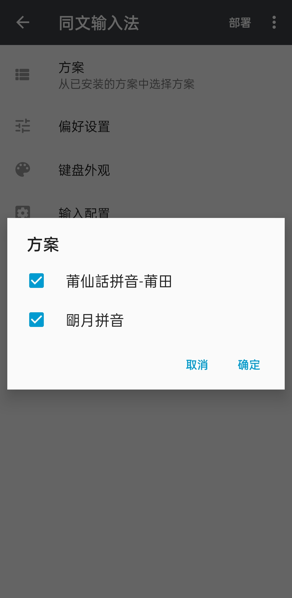

# 莆仙话输入方案

基于 [Rime](https://rime.im/) 的莆仙话拼音输入方案。

目前本方案适用于莆田市区口音（城里腔），其他口音使用者如果有词表也可以联系 [@Yaryou](https://github.com/Yaryou) 制作成输入码表。

## 拼音方案

### 设计理念

由于莆仙话并无清浊对立，拼音的声母采用类普拼式，方便初学者学习掌握；韵母采用国际音标转写式，更为精确。

注：上述方案命名为 `Pouleng` ，同时也提供罗马字写法的拼音方案 `HinghwaBUC` 。

### 方案介绍

- [Pouleng 文件夹内的介绍（内含模糊音介绍）](./Pouleng/README.md) 
- [兴化语记-拼音方案](https://hinghwa.cn/pinyin) 
- [Bilibili 视频](https://www.bilibili.com/video/BV1RJ411q7yW)

## 安装教程

### 下载 RIME

RIME / 中州韵输入法引擎，是一个跨平台的输入法算法框架。

基于这一架构，在不同平台上有着不同的实验，例如 Windows 下的小狼毫， macOS 下的鼠须管， Android 下的同文等。

详情可见 [RIME 官网下载页](https://rime.im/download/) 下载需要的版本。

### 小狼毫

1. 将 `Pouleng` 文件夹下的文件置入用户文件夹
2. 打开 `输入法设定` ，勾选 `莆仙话拼音-莆田` 选项
3. 使用 `` Ctrl+` `` 或 `F4` 选择方案菜单（切换至 `莆仙话拼音-莆田` 选项）

### 同文

将 `Pouleng` 文件夹下的文件置入用户文件夹（默认为 `/sdcard/rime`，手机中的文件的 `rime` 文件夹）

如果你是小白并不知道如何进行高级配置的话，也将 `requirements` 文件夹下的内容置入用户文件夹。

> 使用手机 QQ 传输文件，但找不到 手机 QQ 把这些文件放在哪里？
>
> 答案是：`Android/data/com.tencent.mobileqq/Tencent/QQfile_recv`

随后点击部署，勾选上 `莆仙话拼音-莆田` 即可。

